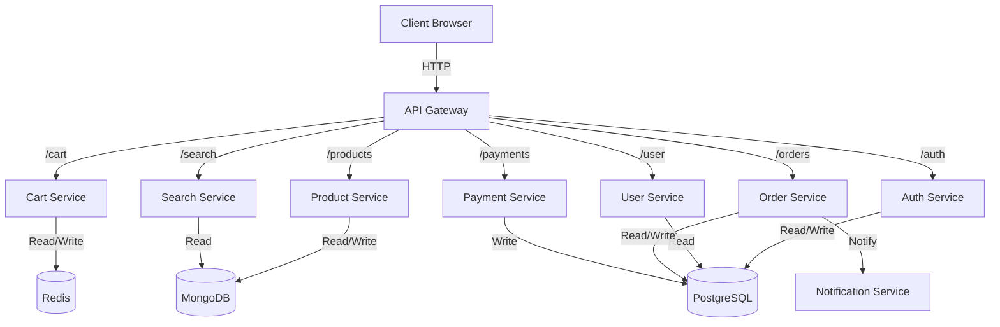

# Shopmate Architecture

## Overview
Shopmate parses microservices patterns to provide a scalable e-commerce solution.
It uses **Node.js** for backend services, **React** for the frontend, and manages state with **PostgreSQL**, **MongoDB**, and **Redis**.

## Service Interaction Flow

## Technology Stack
- **Frontend**: React, Vite, TailwindCSS, Framer Motion
- **Gateway**: Express HTTP Proxy
- **Auth**: JWT, BCrypt
- **Databases**:
  - PostgreSQL 15 (Relational Data)
  - MongoDB 6 (Document Data, Catalog)
  - Redis 7 (Caching)
- **Infrastructure**: Docker, Kubernetes (K8s)

## Directory Structure
- `services/*`: Individual microservices.
- `frontend/`: React SPA source code.
- `k8s/`: Kubernetes YAML manifests.
- `docker-compose.yml`: Local implementation reference.
